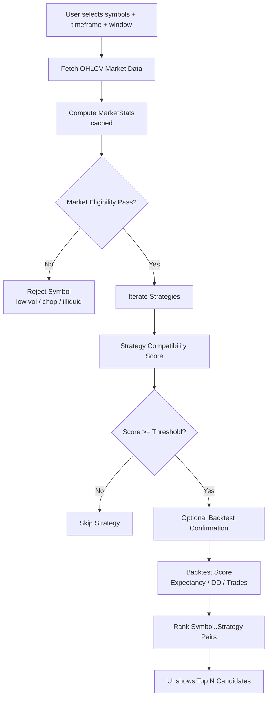
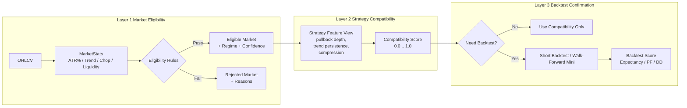
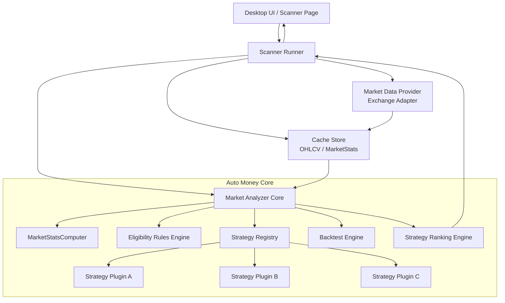
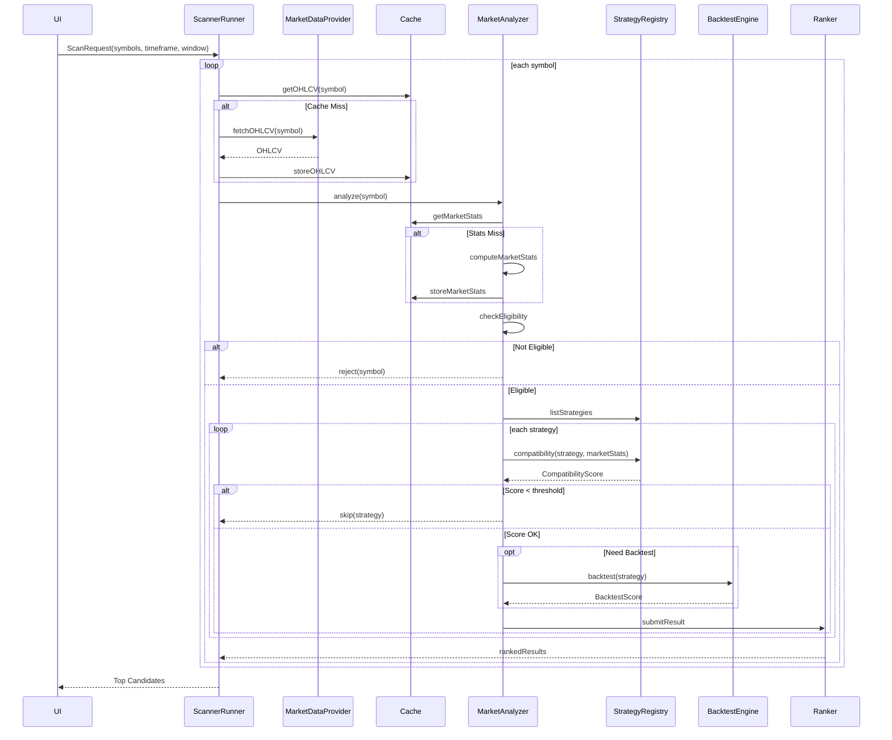
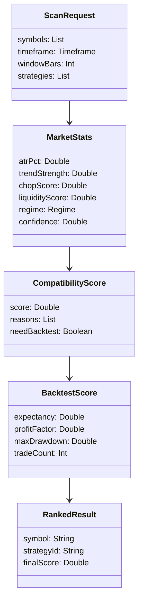

# Market Analysis / Backtest UI Specification

## 1) Header / Strategy Bar (hàng trên cùng)

**Mục đích:**  
Cấu hình **bối cảnh phân tích** trước khi chạy backtest.

### Strategy

- Chọn chiến lược phân tích (vd: **EMA Pullback v7**).
- Ảnh hưởng trực tiếp đến **logic entry / exit, SL / TP**.

### Interval

- Khung thời gian candle (**5m, 15m, 1h…**).
- Toàn bộ **indicator, EMA, ATR, win rate** đều tính trên TF này.

### History

- Số lượng candle dùng cho backtest (vd: **1500**).
- Quyết định **độ tin cậy thống kê**  
  *(trade count, profit factor, drawdown)*.

### Risk %

- % vốn rủi ro mỗi lệnh.
- Dùng cho **mô phỏng position sizing** trong backtest.

### Equity

- Vốn khởi đầu cho backtest.
- **Không phải số dư thật**.

### Fees / Slippage

- Bật / tắt **phí giao dịch** và **trượt giá**.
- Giúp kết quả **sát thực tế** hơn.

### Mode

- **SANDBOX / LIVE**
- Phân biệt:
    - nguồn data
    - ý định sử dụng (*Analyze vs Trade*)

---

## 2) Symbol Selection (cột trái)

**Mục đích:**  
Chọn **coin đầu vào** cho phân tích.

### a) Manual / Auto-pick

- **Manual:** người dùng tự chọn coin.
- **Auto-pick:** hệ thống tự chọn theo logic  
  *(volume, random, gainers…)*.

### b) Search Symbol

- Tìm nhanh coin trong danh sách **USDT-M futures**.

### c) Symbol List

- Danh sách toàn bộ coin futures khả dụng.
- Cho phép **tick nhiều coin**.
- % bên cạnh mỗi coin: **biến động 24h** (tham khảo nhanh).

### d) Selected Count

- Hiển thị số lượng coin đang được chọn để analyze.

---

## 3) Backtest Results (khu trung tâm)

**Mục đích:**  
Hiển thị **kết quả phân tích cốt lõi** – cơ sở để ra quyết định trade.

- Mỗi dòng = **1 symbol** đã backtest.

### Các cột & ý nghĩa

| Cột                    | Ý nghĩa                                      |
|------------------------|----------------------------------------------|
| **Symbol**             | Coin được phân tích                          |
| **Verdict**            | Kết luận hệ thống: **TRADE / WATCH / AVOID** |
| **Score**              | Điểm tổng hợp (**0–100**) dựa trên rule      |
| **Trades**             | Tổng số lệnh trong backtest                  |
| **Win Rate**           | % lệnh thắng                                 |
| **PF (Profit Factor)** | Tổng lãi / tổng lỗ *(>1 là tốt)*             |
| **Max DD**             | Drawdown lớn nhất (%)                        |

👉 **Bảng này trả lời câu hỏi:**
> *“Coin này có đáng trade với strategy hiện tại không?”*

---

## 4) Run Control (cột phải – trên)

**Mục đích:**  
Điều khiển **quá trình phân tích**.

### Analyze Selected

- Bắt đầu chạy backtest cho các symbol đã chọn.

### Cancel

- Dừng analyze đang chạy  
  *(coroutine cancel)*.

### Export CSV

- Xuất kết quả để:
    - lưu lịch sử
    - so sánh nhiều strategy
    - phân tích ngoài app *(Excel, Python)*

---

## 5) Status Panel

**Mục đích:**  
Cung cấp **feedback realtime** khi chạy analyze.

### Status Text

- `Idle` / `Analyzing` / `Done` / `Error`

### Progress

- Ví dụ: **5 / 12**
- Số symbol đã xử lý / tổng số.

→ Giúp user biết app **đang làm gì**, tránh cảm giác bị treo.

---

## 6) Filters (Reactive)

**Mục đích:**  
Lọc kết quả **sau khi backtest**  
*(không chạy lại engine)*.

### Các bộ lọc

- **Min Trades**  
  → Loại coin có sample quá ít.

- **Min Score**  
  → Chỉ giữ coin đạt điểm tối thiểu.

- **Min Volatility (ATR)**  
  → Loại coin quá “lì”, không đủ biên độ.

- **Hide low sample (<10 trades)**  
  → Giảm noise thống kê.

👉 Dùng để tạo **shortlist coin chất lượng cao**.

---

## 7) Auto-pick Logic

**Mục đích:**  
Giúp app **chủ động đề xuất coin** khi user không biết chọn gì.

- **Top by Volume**  
  → Thanh khoản cao, dễ vào lệnh.

- **Random 5 (Diversity)**  
  → Tránh bias, khám phá coin mới.

- **Top Gainers (24h)**  
  → Coin đang có momentum mạnh.

- **Pick 5 Now**  
  → Tự động chọn symbol → đưa sang analyze.

---

## 8) Exclusions

**Mục đích:**  
Loại trừ những coin **không phù hợp strategy**.

- **Stablecoins**  
  → Gần như không biến động.

- **Leveraged Tokens**  
  → Dễ méo dữ liệu, rủi ro cao.

# Auto Money v7 – Market Analysis (Full Charts)

Tài liệu này mô tả **toàn bộ kiến trúc và luồng phân tích thị trường**
theo mô hình **3 tầng**:

1. Market Eligibility
2. Strategy Compatibility
3. Backtest Confirmation

Thiết kế này **scale tốt khi có nhiều strategy plugin** và giữ core sạch.

---

## 1. Overall Scan Flow (Multi-Symbol, Multi-Strategy)

---

## 2. Three-Layer Analysis Detail

---

## 3. Component Diagram (Core Clean Architecture)

---

## 4. Sequence Diagram (One Symbol – Many Strategies)

---

## 5. Data Objects Flow (Class Diagram)

---

## Key Principles

- Market analysis **không phụ thuộc strategy**
- Strategy chỉ tự đánh giá **độ phù hợp**
- Backtest là bước **xác nhận**, không phải gate đầu
- Kiến trúc **scale tuyến tính** theo số strategy

---
